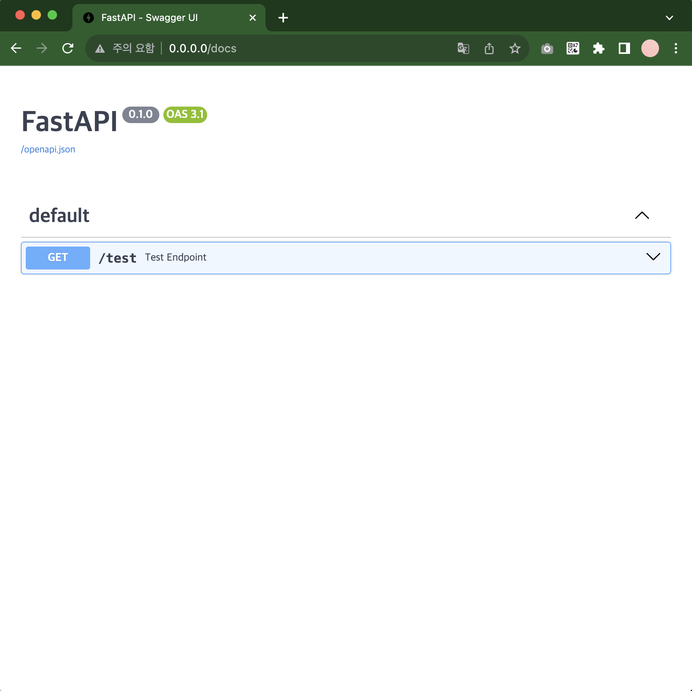

# TTM
Auto trade and manage stocks/coins platform
<p align="center">
</p>
  <p align="center">
    <a href="https://github.com/anuraghazra/github-readme-stats/actions">
      
    </a>
    <a href="https://codecov.io/gh/anuraghazra/github-readme-stats">
      
    </a>
    <br />
    <a href="https://github.com/anuraghazra/github-readme-stats/issues">
      
    </a>
    <a href="https://github.com/anuraghazra/github-readme-stats/pulls">
      
    </a>
    <br />
    <br />

  </p>


## Requirements
- python 12.0
- poetry 1.6.1
- fastapi 0.104.1


## Installation
### 1. Download repo
```
git clone https://github.com/CasselKim/TTM.git`
```

### 2. Download poetry
https://python-poetry.org/docs/#installing-with-the-official-installer

### 3. Create venv
```
poetry install
```

### 4. Configuration
Create `.env` file and set the following environment variables:
```bash
# Upbit API Keys
UPBIT_ACCESS_KEY=your_upbit_access_key_here
UPBIT_SECRET_KEY=your_upbit_secret_key_here

# Discord Bot Settings (optional)
DISCORD_BOT_TOKEN=your_discord_bot_token_here
DISCORD_HISTORY_CHANNEL_ID=your_DISCORD_HISTORY_CHANNEL_ID_here
DISCORD_ALERT_CHANNEL_ID=your_DISCORD_ALERT_CHANNEL_ID_here  # For error notifications (optional, defaults to HISTORY_CHANNEL)
DISCORD_LOG_CHANNEL_ID=your_DISCORD_LOG_CHANNEL_ID_here    # For debug logs (optional, defaults to HISTORY_CHANNEL)

# Discord Admin User IDs for trading commands (comma-separated)
# Enable Developer Mode in Discord and right-click user to copy ID
DISCORD_ADMIN_USER_IDS=123456789012345678,987654321098765432

# Infinite Buying Algorithm Settings
ENABLE_INFINITE_BUYING_SCHEDULER=true    # Enable/disable infinite buying algorithm
INFINITE_BUYING_INTERVAL_SECONDS=30      # Execution interval for infinite buying (30s recommended)

# Logging Settings
LOG_LEVEL=INFO
LOG_FILE=logs/app.log
```

#### Discord Bot Setup
1. Go to [Discord Developer Portal](https://discord.com/developers/applications)
2. Create a new application and go to the Bot section
3. Create a bot and copy the bot token
4. Enable necessary Intents (MESSAGE CONTENT INTENT is required)
5. Invite the bot to your server with appropriate permissions (Send Messages, Embed Links, Add Reactions)
6. Get the channel ID where you want the bot to send messages (Enable Developer Mode in Discord)
7. Get your Discord User ID for admin privileges (Enable Developer Mode and right-click your profile)
8. Set the `DISCORD_BOT_TOKEN`, `DISCORD_HISTORY_CHANNEL_ID`, and `DISCORD_ADMIN_USER_IDS` in your `.env` file

### 5. Execute docker
```
docker build -f docker/Dockerfile . -t ttm-image
docker compose -f docker/docker-compose-local.yml -p ttm up -d
```
### 5. Check the access
http://0.0.0.0/docs


## Deployment - Github Action
1. PR open
2. Test by github action
3. Auto-merge when test pass
4. Build as image and push to Docker hub
5. Run the image on the AWS EC2 through github action

## License
This project is licensed under the terms of the MIT license.

## Features

### Trading
- **Upbit Integration**: Support for limit/market buy/sell orders
- **Account Management**: Check balances and account information
- **Market Data**: Real-time ticker information
- **Order Management**: View and cancel orders

### Automated Trading
- **Infinite Buying Algorithm**: Implements Lao-Er's infinite buying strategy
  - Dollar-cost averaging through staged purchases
  - Automatic buy on price drops (configurable threshold)
  - Take profit at target return rate
  - Risk management with maximum rounds and stop-loss
  - Individual market management with separate cycles
- **Background Scheduler**: Runs infinite buying algorithm every 30 seconds
- **Live Trading Mode**: Real trading with actual buy/sell orders
- **Real-time Notifications**: Discord alerts for all buy/sell executions

### Discord Bot Commands
- **Basic Commands** (All users):
  - `!잔고` or `!balance` - Check account balance
  - `!시세 [MARKET]` or `!price [MARKET]` - Get ticker information
  - `!도움말` or `!명령어` - Show help message

- **Trading Commands** (Admin only):
  - `!매수 [MARKET] [AMOUNT]` - Market buy order
  - `!매수 [MARKET] [VOLUME] [PRICE]` - Limit buy order
  - `!매도 [MARKET] [VOLUME]` - Market sell order
  - `!매도 [MARKET] [VOLUME] [PRICE]` - Limit sell order
  - `!주문조회 [UUID]` - Get order information
  - `!주문취소 [UUID]` - Cancel order

- **Infinite Buying Commands** (Admin only):
  - `!무한매수시작 [MARKET] [INITIAL_AMOUNT] [TARGET_PROFIT] [DROP_THRESHOLD] [MAX_ROUNDS]` - Start infinite buying
    - Example: `!무한매수시작 KRW-BTC 100000 10 5 10` (100k KRW, 10% profit target, 5% drop threshold, max 10 rounds)
  - `!무한매수조회 [MARKET]` - Check infinite buying status
  - `!무한매수종료 [MARKET] [FORCE_SELL]` - Stop infinite buying
    - Example: `!무한매수종료 KRW-BTC true` (force sell all holdings)

- **Security Features**:
  - Admin-only access for trading commands
  - Interactive confirmation for all trades
  - Maximum trade amount limits
  - 10-second timeout for confirmations

### Notifications
- **Discord Bot Notifications**: Get real-time alerts via Discord Bot for:
  - Infinite buying executions (buy/sell with detailed stats)
  - Manual trade executions
  - Order cancellations
  - Error notifications and cycle completions
  - System status updates
- **Error Monitoring**: Automatic Discord alerts for all application errors:
  - HTTP exceptions and unhandled errors
  - Background task failures
  - Logging errors (ERROR level and above)
  - Separate alert channel support for critical notifications
- **Debug Logging**: Complete application logging to Discord:
  - All log levels (DEBUG, INFO, WARNING, ERROR, CRITICAL)
  - Detailed stack traces and function information
  - Separate log channel for development monitoring
- **Rich Embed Messages**: Beautiful formatted messages with colors and fields
- **Detailed Trading Info**: Shows current round, average price, total investment, target price

## API Endpoints
- `GET /health` - Health check endpoint
- `GET /infinite-buying/status` - Get infinite buying status for all markets
- `GET /test-error` - Error notification test endpoint (non-production only)

## Testing Discord Bot
Run the Discord bot test script:
```bash
python scripts/test_discord_bot.py
```
